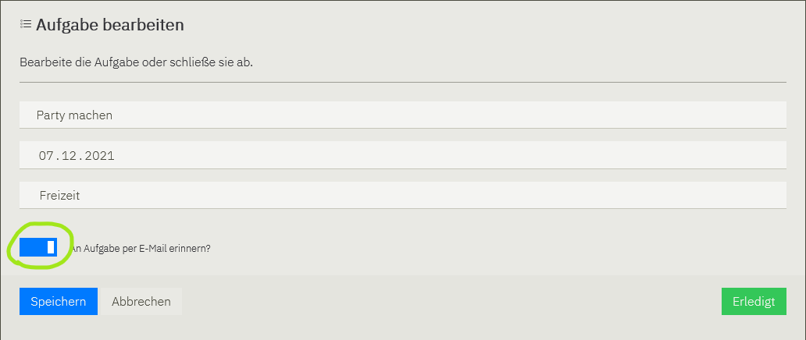
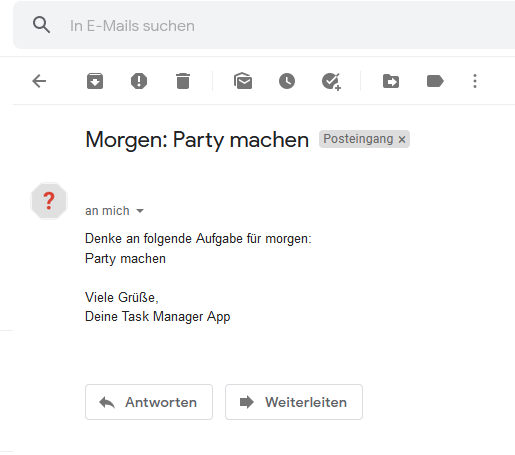

# E-Mail-Benachrichtigung

1. [Aktivieren der Benachrichtigung](#aktivieren-der-benachrichtigung)
2. [Aufbau der Benachrichtigung](#aufbau-der-benachrichtigung)
3. [PHP-Klasse mit Datenbank-Credentials](#php-klasse-mit-datenbank-credentials)

Um nicht ständig in der App nachschauen zu müssen, ob unerledigte Aufgaben vorliegen, besteht die Möglichkeit,
sich per E-Mail benachrichtigen zu lassen.

## Aktivieren der Benachrichtigung
Wird der Haken bei "An Aufgabe per E-Mail erinnern?" gesetzt, erhält der Nutzer 24 Stunden vor Beginn eine
Erinnerungsnachricht. Die Option ist sowohl beim Erstellen als auch beim Aktualisieren von Aufgaben wählbar.



## Aufbau der Benachrichtigung
Der Aufbau der E-Mail lässt sich in der Datei [/cron/notice_user.php](../cron/notice_user.php) anpassen.



## PHP-Klasse mit Datenbank-Credentials
Damit keine geheimen Zugangsdaten veröffentlicht werden, erzeuge bitte im Ordner **./cron** folgende Datei:

````php
# ./cron/secret.php
<?php

namespace cron;

class secret
{
    protected array $secret;

    public function __construct()
    {
        $this->setSecret([
        'DB_TYPE' => 'mysql',
        'DB_HOST' => 'localhost',
        'DB_NAME' => 'Name der Datenbank',
        'DB_USER' => 'Datenbankbenutzer',
        'PASS' => 'Passwort des Datenbankbenutzers',
        'EMAIL_SENDER_NAME' => 'Absendername',
        'EMAIL_SENDER_ADDRESS' => 'E-Mail-Adresse des Absenders'
    ]);
    }

    /**
     * @return array
     */
    public function getSecret(): array
    {
        return $this->secret;
    }

    /**
     * @param array $secret
     */
    public function setSecret(array $secret): void
    {
        $this->secret = $secret;
    }

}

````